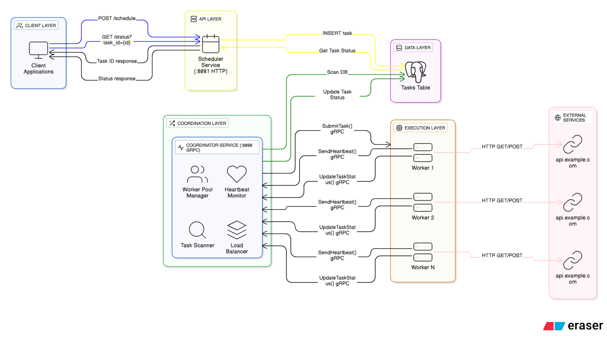

# Schedulo - Distributed Task Scheduler

A distributed task scheduling system built with Go, gRPC, and PostgreSQL that executes HTTP requests at specified times. Features horizontal scalability, fault tolerance, and efficient task distribution.

## Architecture Overview



## Demo

[](https://www.loom.com/share/cdc33158a5c546028f516591293df8ec)

**Schedulo** consists of four main components:

### 1. **Scheduler Service** (HTTP API Layer)

- Exposes REST endpoints for task submission and status tracking
- Validates and persists tasks to PostgreSQL
- Handles task scheduling requests with ISO 8601 timestamps

### 2. **Data Layer** (PostgreSQL)

- Stores task metadata with UUID primary keys
- Tracks task lifecycle: `scheduled_at`, `picked_at`, `started_at`, `completed_at`, `failed_at`

### 3. **Coordinator Service** (gRPC)

- **Database Scanning**: Polls database every 10 seconds for tasks ready to execute
- **Exclusive Row-Level Locking**: Uses `SELECT ... FOR UPDATE SKIP LOCKED` to prevent race conditions
- **Transaction Management**: Atomic task assignment with proper commit/rollback handling
- **Worker Pool Management**:
  - Maintains active worker registry with health monitoring
  - Implements round-robin load balancing across workers
  - Thread-safe worker pool using `sync.Mutex` and `sync.RWMutex`
  - Removes inactive workers after missing heartbeats
- **Heartbeat Protocol**: Workers send heartbeats every 5 seconds

### 4. **Worker Service** (Execution Layer)

- **gRPC Server**: Receives task submissions from coordinator
- **Worker Pool**: Configurable number of goroutines (default: 5)
- **Task Execution**:
  - Performs HTTP requests with configurable timeouts (10s)
  - Supports bearer token authentication
  - Handles JSON payloads
- **Status Updates**: Reports task lifecycle events to coordinator
- **Graceful Shutdown**: Uses context cancellation and `sync.WaitGroup`

### External Services

Tasks can invoke any HTTP endpoint (e.g., `api.example.com`)

## Key Technical Features

### Concurrency & Synchronization

- **Mutex Protection**: All shared state protected with appropriate locks
- **Context-Based Cancellation**: Graceful shutdown across all goroutines
- **WaitGroup Coordination**: Ensures all workers complete before shutdown

### Database Optimizations

- **Row-Level Locking**: `FOR UPDATE SKIP LOCKED` prevents task duplication
- **Transaction Isolation**: ACID compliance for task state transitions
- **Indexed Queries**: `scheduled_at` index for efficient task scanning

### Network Communication

- **gRPC**: Low-latency binary protocol for inter-service communication
- **Protocol Buffers**: Efficient serialization with strong typing
- **Connection Pooling**: Reused connections with PostgreSQL (pgxpool)

### Fault Tolerance

- **Heartbeat Monitoring**: Automatic worker deregistration on failure
- **Retry Logic**: Database connection retries with exponential backoff
- **Graceful Degradation**: System continues with reduced worker capacity

## Usage

### Prerequisites

- Docker & Docker Compose
- Go 1.25+ (for local development)

### Quick Start

1. **Clone the repository**

```bash
git clone https://github.com/subediDarshan/schedulo.git
cd schedulo
```

2. **Configure environment**

```bash
# Create .env file
cat > .env << EOF
POSTGRES_DB=schedulo
POSTGRES_USER=admin
POSTGRES_PASSWORD=secure_password
EOF
```

3. **Start the system** (with 3 workers)

```bash
docker compose up --scale worker=3
```

Services will be available at:

- Scheduler API: `http://localhost:8081`
- Coordinator gRPC: `localhost:8080`
- PostgreSQL: `localhost:5432`

### API Endpoints

#### Schedule a Task

```bash
POST http://localhost:8081/schedule
Content-Type: application/json

{
  "endpoint": "https://postman-echo.com/post",
  "scheduled_at": "2025-10-29T15:30:00Z",
  "method": "POST",
  "bearer_token": "your-token-here",
  "payload": {"key": "value"}
}
```

**Response:**

```json
{
  "task_id": "550e8400-e29b-41d4-a716-446655440000",
  "endpoint": "https://postman-echo.com/post",
  "scheduled_at": "2025-10-29T15:30:00Z"
}
```

#### Check Task Status

```bash
GET http://localhost:8081/status?task_id=550e8400-e29b-41d4-a716-446655440000
```

**Response:**

```json
{
  "task_id": "550e8400-e29b-41d4-a716-446655440000",
  "endpoint": "https://postman-echo.com/post",
  "scheduled_at": "2025-10-29T15:30:00Z",
  "picked_at": "2025-10-29T15:29:55Z",
  "started_at": "2025-10-29T15:30:01Z",
  "completed_at": "2025-10-29T15:30:02Z"
}
```

### Scaling Workers

```bash
# Scale to 5 workers
docker-compose up --scale worker=5 -d

# Scale down to 1 worker
docker-compose up --scale worker=1 -d
```

## Configuration

Key parameters (edit service files):

- `DefaultHeartbeatInterval`: 5 seconds
- `defaultScanInterval`: 10 seconds
- `defaultMaxHeartbeatMisses`: 1
- `workerPoolSize`: 5 concurrent task processors
- Task execution timeout: 10 seconds